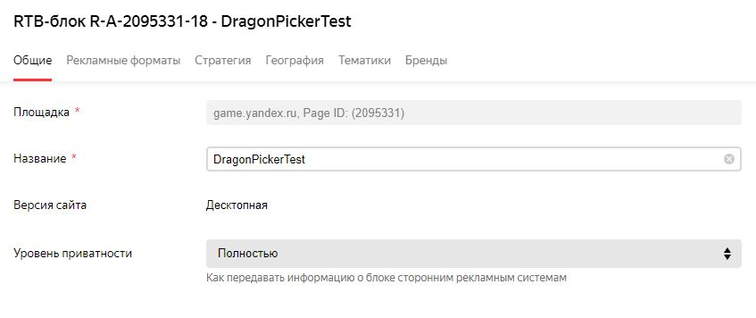
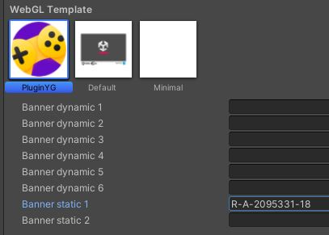
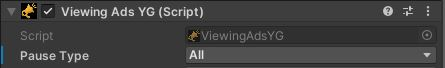
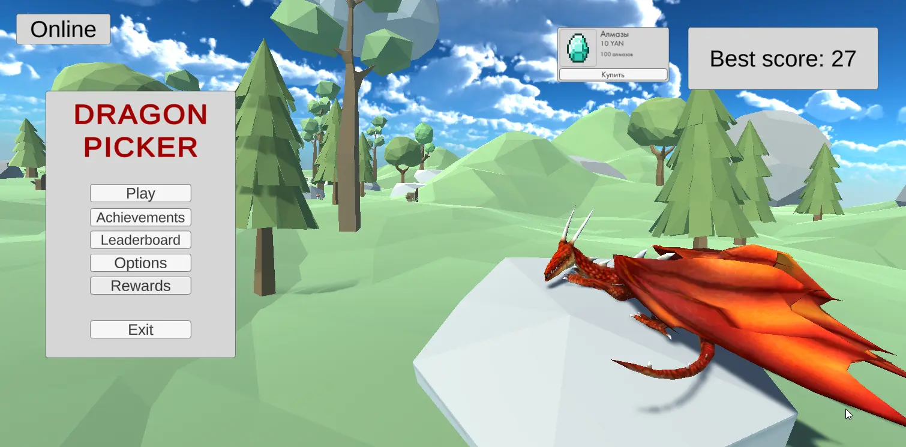
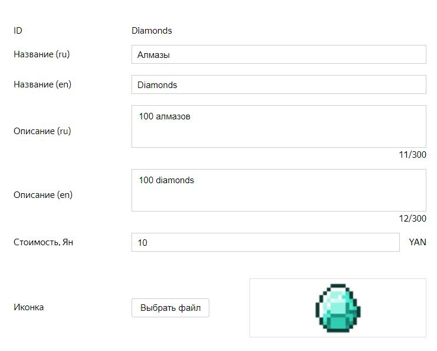
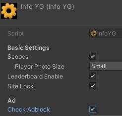
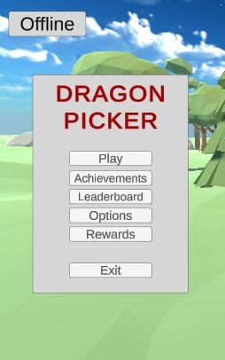

# РАЗРАБОТКА ИГРОВЫХ СЕРВИСОВ
### Ссылка на проект: https://github.com/A-Zaikin/DragonPicker
Отчет по лабораторной работе #6 выполнил:
- Заикин Александр Юрьевич
- РИ300012
Отметка о выполнении заданий (заполняется студентом):

| Задание | Выполнение | Баллы |
| ------ | ------ | ------ |
| Задание 1 | * | 60 |
| Задание 2 | * | 20 |
| Задание 3 | * | 20 |

знак "*" - задание выполнено; знак "#" - задание не выполнено;

Работу проверили:
- к.т.н., доцент Денисов Д.В.
- к.э.н., доцент Панов М.А.
- ст. преп., Фадеев В.О.

## Цель работы
Интеграция рекламных сервисов в интерактивное приложение.

## Задание 1
### Используя видео-материалы практических работ 1-5 повторить реализацию функционала
Ход работы:
#### Работа 1: «Интеграция баннерной рекламы»
1) Заполнить страницу приложения до 86%.
2) Зарегистрироваться в Яндекс РСЯ.
3) Добавить тестовый рекламный блок:



4) Добавить ID рекламного блока в настройки PluginYG:



#### Работа 2: «Интеграция видеорекламы»
1) Добавить код показа рекламы после прогрыша и при запуске игры:
```cs
YandexGame.RewVideoShow(0);
```
2) Поставить в YandexGame полную паузу при рекламе: 



#### Работа 3: «Показ видеорекламы пользователю за вознаграждение»
1) Добавить новый объект со скриптом:
```cs
using UnityEngine;
using YG;

public class AdRewardManager : MonoBehaviour
{
    public void OpenAd() => YandexGame.RewVideoShow(0);

    private void OnEnable() => YandexGame.CloseVideoEvent += OnReward;

    private void OnDisable() => YandexGame.CloseVideoEvent -= OnReward;

    private void OnReward(int id) => Debug.Log("Player rewarded!");
}
```
2) Добавить кнопку на главное меню, которая вызывает метод OpenAd().



#### Работа 4: «Создание внутриигрового магазина»
1) Добавить предмет на Яндекс Консоль:



2) Добавить из YandexGame префаб OnePurchase на сцену, установить ему ID из консоли.

#### Работа 5: «Система антиблокировки рекламы»
1) Поставить проверку адблока в параметрах плагина:




## Задание 2
### Добавить в приложение интерфейс для вывода статуса наличия игрока в сети (онлайн или офлайн).
Ход работы:
1) Добавить текст в главное меню:



2) Добавить изменение текста при успешном подключении в онлайн и загрузке SDK:
```cs
private void SdkDataReceived()
{
    if (!YandexGame.SDKEnabled || !YandexGame.auth)
    {
        return;
    }

    onlineLabel.text = "Online";
}
```


## Задание 3
### Предложить наиболее подходящий на ваш взгляд способ монетизации игры D.Picker. Дать развернутый ответ с комментариями.

Игра является классической аркадной игрой по типу "пройди как можно дальше" / "собери как можно больше очков". Наиболее соответсвующие методы монетизации для данного жанра:
- +1 жизнь за рекламу / валюту.
- покупка скинов на персонажа / шар / дракона.
- постоянное улучшение характеристик (скорость, размер шара) за обычную (получаемую внутри игры) и премиальную валюты.
- покупка расходуемых способностей (очистить экран, замедлить дракона).

Метод покупок можно реализовать как за реальные деньги напрямую, так и за премиальную валюту (косвенно). Преимущества косвенного метода:
- клиенты более позитивно воспринимают цену, не ассоциируя её с реальными деньгами.
- можно продавать количество валюты, не соответствующее цене покупок, чтобы у клиентов всегда был остаток после покупки, что стимулирует следующую покупку.

## Выводы

Изучены:
- способы монетизации приложения,
- дополнительные функции Яндекс SDK.


## Powered by

**BigDigital Team: Denisov | Fadeev | Panov**
